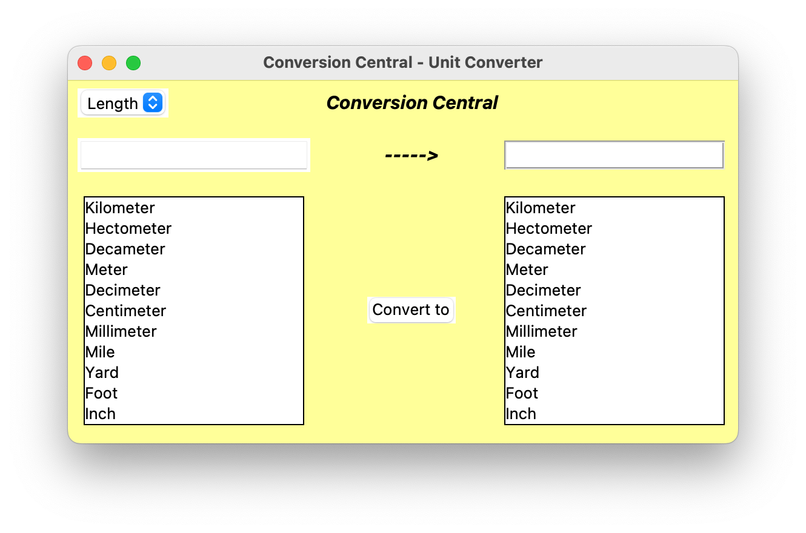

# Conversion-Central

My first ever personal programming project in the form of a unit conversion Python app. The app uses Tkinter to create the GUI, and it uses py2app to create an executable MacOS app. To run the application, enter "python3 ConversionCentral.py". If creating the MacOS app executable, run "python3 setup.py py2app --iconfile=Icon.icns". The app will be found in the _dist_ folder, but there is already a build there that can be executed.

